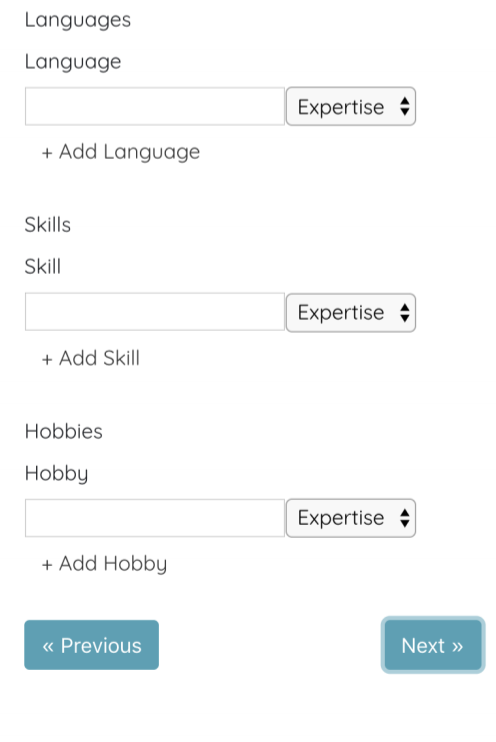

# A website for screening job applicant from their CV automatically

Built as part of a competition hosted by Deutsche Bank.

Concept was to help them shift towards a more dynamic hiring process.

Uses a larger training set that stored in this repository to predict if an applicants CV is good enough to move them onto an interview

# Features
## Neural network
A neural network with 8 hidden layers like this one...


...that was trained on around 300 test CVs (more can be trained from the training sets provided to improve its accuracy)...

...to predict if a resume should move onto the phone interview stage for Deutsche Bank.

## Reports and reinforcement learning
A report of every applicant that was selected for a phone interview is provided, like the one below...


...to get a quick overview...

...and you can provide feedback using sliders to perform reinforcement learning and improve the accuracy of the system in the future!


## API
The backend is fully portable and any frontend that consumes the REST API will be able to use the Neural network...

...thanks to API endpoints like this one with lets you get a jobs in a variety of formats...

```python
urlpatterns = [
    re_path(r'^all_jobs/$', get_all_jobs_view, name='get-all-jobs'),
    re_path(r'^all_available_jobs/$', get_all_available_jobs_view, name='get-all-available-jobs'),
    re_path(r'^all_not_available_jobs/$', get_all_available_jobs_view, name='get-all-not-available-jobs'),
]
```

...it also doesn't use the default Django database connections because the original requirement had a custom database API...

...so you can also have a custom API and with a few model changes!

##Website

If don't want to use a custom frontend you can use the website we have developed, here are a few screenshots of the CV building functionality it offers...


...and another one...


...and another one!



### Disclaimer: There are still things that need to be added to the website to fully consume all the functionality the API offers

The features the website can perform are ticked off but the ones you might have to implement are not

- [x] Login as an applicant and a recruiter
- [x] Fill in a standardised CV as an applicant  
- [x] Display machine learning reports to recruiters
- [ ] Create new job postings as a recruiter
- [ ] Use sliders to provide feedback for reinforcement learning
